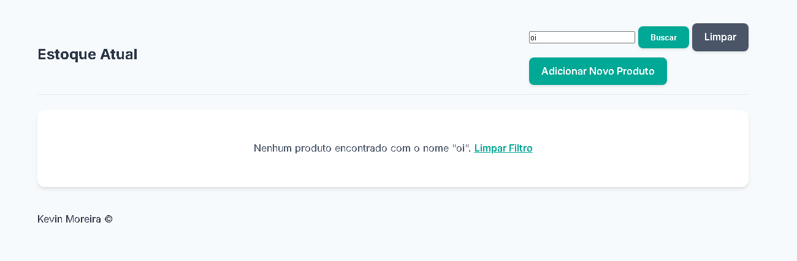

# Estoque+  

  

Sistema simples de gerenciamento de estoque feito com **Python** e **SQLite**. Permite adicionar, remover e listar produtos de forma rápida e prática. Ideal para aprendizado ou para quem quer uma solução básica de controle de inventário.

---

## 🚀 Funcionalidades

  <code>➕ Adicionar produtos</code> &nbsp;&nbsp; | &nbsp;&nbsp;
  <code>➖ Remover produtos</code> &nbsp;&nbsp; | &nbsp;&nbsp;
  <code>📋 Listar produtos</code> &nbsp;&nbsp; | &nbsp;&nbsp;
  <code>💾 SQLite</code>

---

## 🖼️ Preview / Demo

  
  
  

---

## 🛠 Tecnologias

  <code>Python</code> &nbsp;&nbsp; | &nbsp;&nbsp; <code>SQLite</code> &nbsp;&nbsp; | &nbsp;&nbsp; <code>Git/GitHub</code>

---

## ⚡ Como usar

1. Clone o repositório:  
<pre><code>git clone https://github.com/kevinscodes/estoque-plus.git</code></pre>
2. Abra o projeto com seu editor de preferência.
3. Execute o arquivo principal:  
<pre><code>python app.py</code></pre>

---

## 🤝 Contribuição

Sinta-se à vontade para abrir issues ou pull requests para melhorias!

---

## 📄 Licença

MIT License — veja o arquivo <code>LICENSE</code> para mais detalhes.

