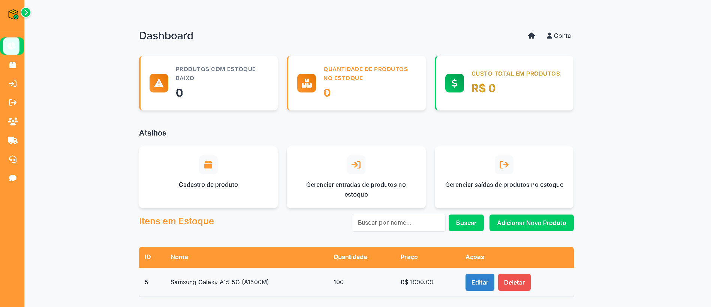
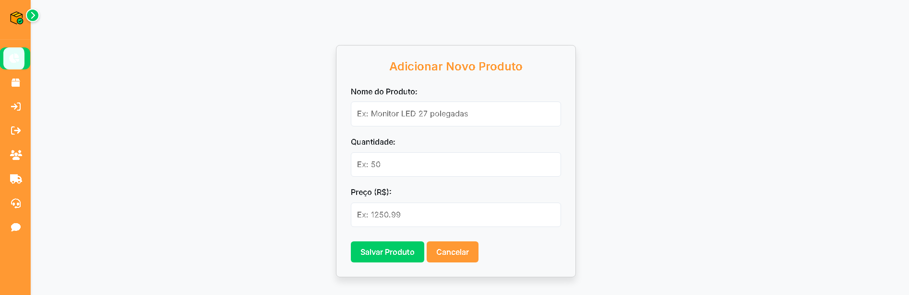
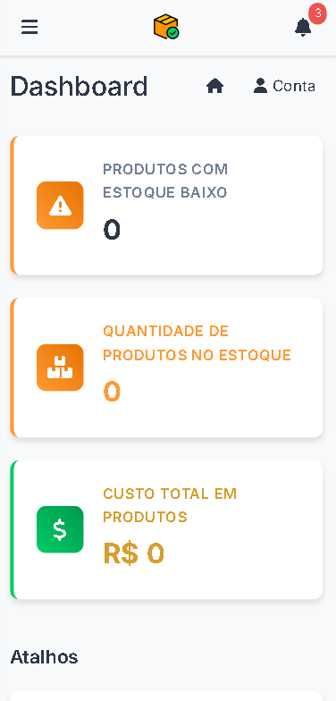
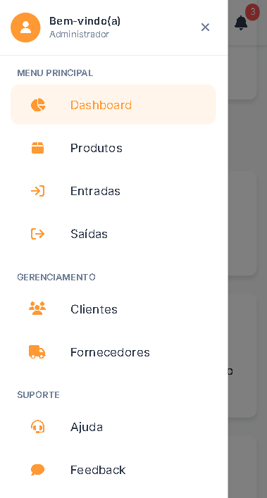

# Estoque+  

<p align="center">
  
</p>

Sistema simples de gerenciamento de estoque feito com **Python** e **SQLite**.  
Permite adicionar, remover e listar produtos de forma rápida e prática.  
Ideal para aprendizado ou para quem quer uma solução básica de controle de inventário.

---

## 🚀 Funcionalidades

<p align="center">
  <code>➕ Adicionar produtos</code> &nbsp;&nbsp; | &nbsp;&nbsp;
  <code>➖ Remover produtos</code> &nbsp;&nbsp; | &nbsp;&nbsp;
  <code>📋 Listar produtos</code> &nbsp;&nbsp; | &nbsp;&nbsp;
  <code>💾 SQLite</code>
</p>

---

## 🖼️ Preview / Demo - Desktop

<p align="center">
  
  
</p>

---

## 📱 Preview / Demo - Mobile

<p align="center">
  
  
  
</p>

---

## 🛠 Tecnologias

<p align="center">
  <code>Python</code> &nbsp;&nbsp; | &nbsp;&nbsp;
  <code>SQLite</code> &nbsp;&nbsp; | &nbsp;&nbsp;
  <code>Git/GitHub</code>
</p>

---

## ⚡ Como usar

1. Clone o repositório:  
   ```bash
   git clone https://github.com/kevinscodes/estoque-plus.git

2. Abra o diretório raiz (estoque-plus)

3. Execute o arquivo "server.py" no editor de código

     Exemplo usando Prompt de comando do Windows:
    ```bash
   python app.py

   
